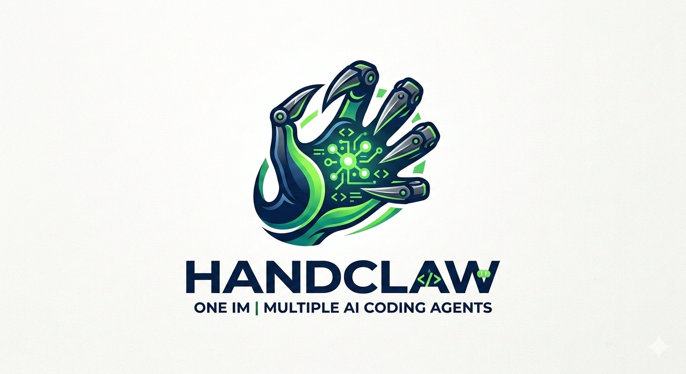
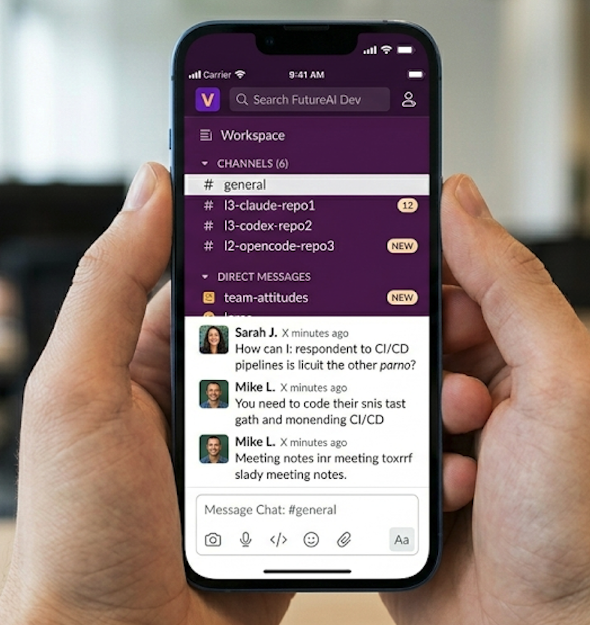
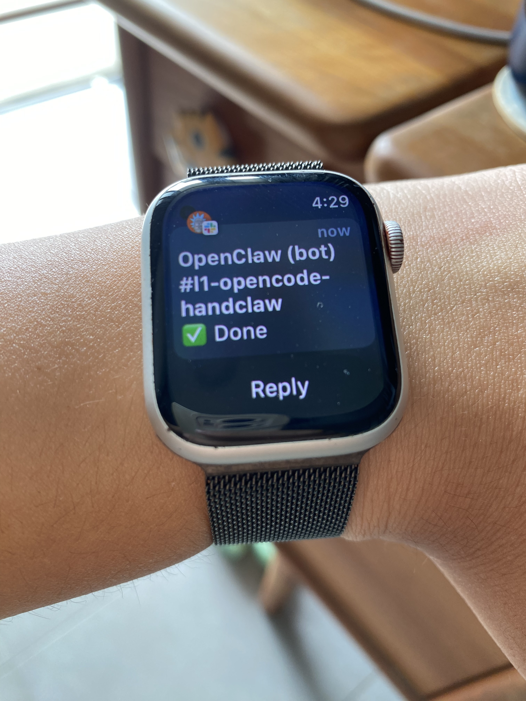
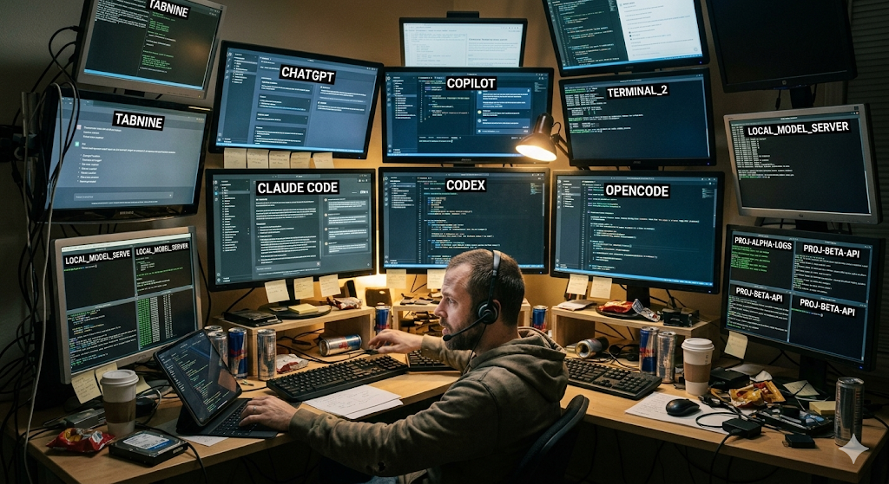
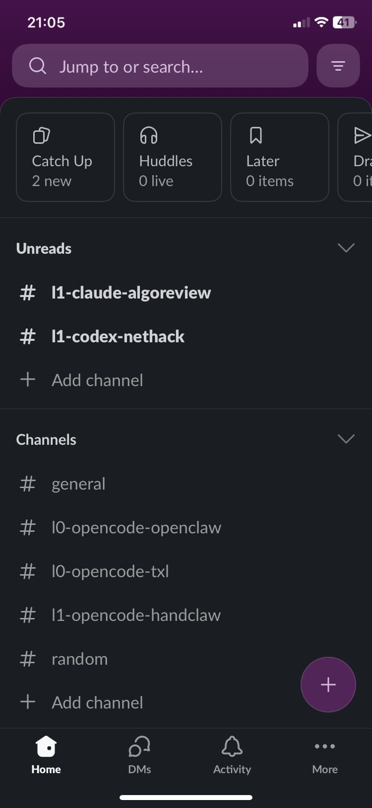
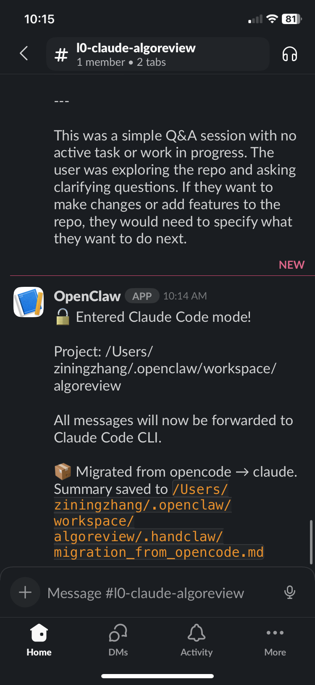
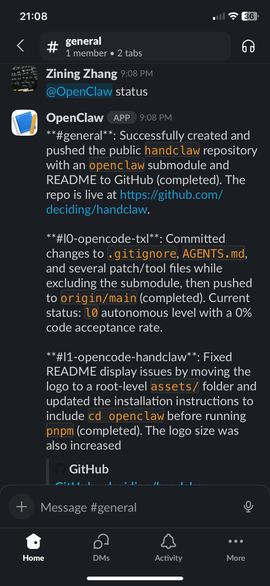
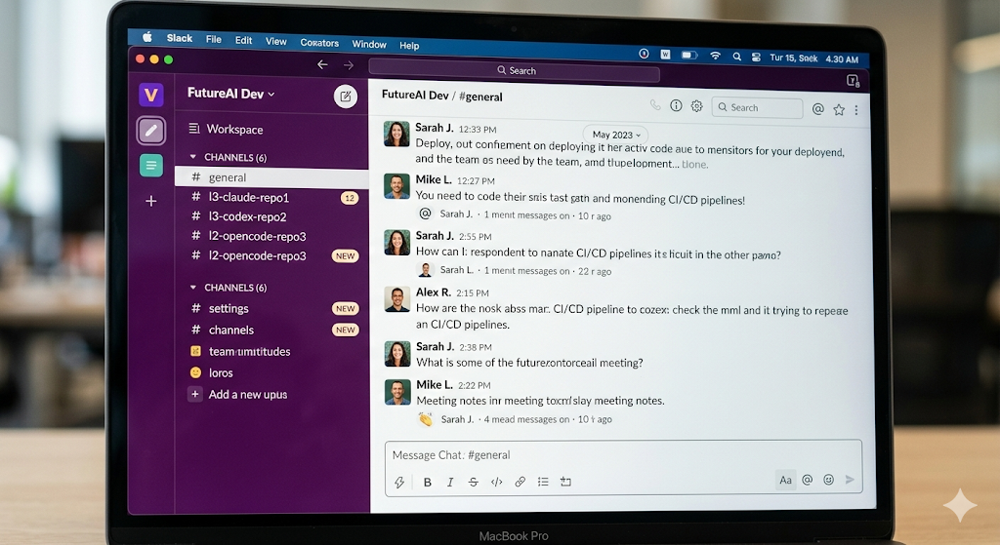

# 🤖 handclaw

<p align="center">
  
</p>

<p align="center">
  <strong>One HandClaw — Many Projects</strong>
</p>

<p align="center">
  You don't need many openclaws. You just need one to control all.<br/>
  (Slack, WhatsApp, Discord, Telegram, Feishu)
</p>

---

## Install (Node ≥22)

```
npm install -g handclaw@latest
# or: pnpm add -g handclaw@latest

handclaw onboard --install-daemon
```

---

## ✨ What is handclaw?

Connect AI coding agents (**Claude Code**, **Codex**, **OpenCode**) to **Slack**, **WhatsApp**, **Discord**, **Telegram**, or **Feishu**. Each channel uses one CLI, different channels can use different ones.

<p align="center">
  
</p>


- One workspace, multiple agents
- Multi-round conversations
- Switch agent by renaming channel

---

## With handclaw — AFK Now

<p align="center">
  
  
</p>

- One workspace = Multiple agents
- Code from phone, even from your watch
- Walk away, let agents work

---

## My Story

### Me Previously — Stuck at Desk

<p align="center">
  
</p>

- Multiple monitors (5+ windows)
- Claude Code, Codex, OpenCode — all open at once
- Tethered to laptop, can't leave desk
- Every task needs me sitting in front of the computer

---

## 🎯 Features

### 📱 Mobile-First Development
Work anywhere. From your phone, tablet, or any device with Slack. Your coding agents are always accessible.

### ⚡ Thinking Process
The thinking process is streamed to the user.

### 🧠 Self-Evolution Skills

Add skills to your coding agents (Codex/OpenCode/Claude Code) for enhanced capabilities:

- `skills/project_workflow` — Project workflow automation (build, test, deploy)

> ⚠️ **Important**: You must add skills to your coding agents manually. Each agent has its own skill loading mechanism.

### 📂 One Channel = One Agent = One Project

Each Slack channel = one project with built-in autonomous level control:

```
#l0-claude-repo1    → Level 0 (lowest, 80% need user agreement)
#l1-opencode-repo2  → Level 1 (moderate autonomy)
#l2-codex-prod      → Level 2 (high autonomy)
```

- **l0**: 80% of actions need your approval
- **l1**: 50% autonomous  
- **l2**: Fully autonomous (trust the agent)

### 🔀 Migration & Status

Just rename the channel to switch agent and autonomous level!

<table>
  <tr>
    <td align="center">
      <br/>
      <strong>Channel Naming</strong><br/>
      <em>l0-claude-repo1</em>
    </td>
    <td align="center">
      <br/>
      <strong>Migration</strong><br/>
      <em>Rename to switch</em>
    </td>
    <td align="center">
      <br/>
      <strong>Status</strong><br/>
      <em>`@BotApp status` to check</em>
    </td>
  </tr>
</table>

```
#l1-opencode-repo1 → #l0-claude-repo1
```

### 📊 Status Commands

- `!rate` — Check autonomous level and your acceptance rate
- `@OpenClawApp status` — Summarize all channels' progress

### 🔄 Plan ↔ Build Mode

- `!plan` — One-time plan request
- `!build` — One-time build request

---

## 📸 Demo

<p align="center">
  
</p>

**Live Demo**: _[Add your demo URL here]_

---

## 🛠️ Quick Start

```bash
# Clone and install dependencies
git clone https://github.com/deciding/handclaw.git
cd handclaw
git submodule update --init --recursive
cd openclaw

# Install and build
pnpm install
pnpm ui:build
pnpm build

# Set up Slack connection and install daemon
pnpm handclaw onboard --install-daemon
```

### Slack Configuration

See [SLACK_INSTALL.md](./SLACK_INSTALL.md) for setup instructions.

Set these in your Slack config:

```json
{
  "requireMention": false,
  "groupPolicy": "open",
  "streaming": "block"
}
```

- `requireMention: false` — Respond to any message in the channel
- `groupPolicy: open` — Allow any channel to use handclaw
- `streaming: block` — Wait for complete response before sending

### WhatsApp Configuration

```json
{
  "groups": {
    "120363407410666666@g.us": { // group ID (get from logs)
      "requireMention": false
    }
  },
  "groupPolicy": "allowlist",
  "groupAllowFrom": ["phone-number"]
}
```

### Telegram Configuration

```json
{
  "enabled": true,
  "dmPolicy": "pairing",
  "botToken": "YOUR_BOT_TOKEN",
  "groups": {
    "-5128902136": { // group ID
      "requireMention": false,
      "enabled": true
    }
  },
  "groupAllowFrom": [],
  "groupPolicy": "allowlist",
  "streaming": "block"
}
```

### Discord Configuration

```json
{
  "enabled": true,
  "token": "YOUR_DISCORD_TOKEN",
  "groupPolicy": "open",
  "streaming": "off",
  "guilds": {
    "1480825735710118119": { // guild ID
      "channels": {
        "*": { // channel ID
          "requireMention": false
        }
      }
    }
  }
}
```

### How to Get IDs

- **Telegram**: @BotFather to create bot, @myidbot /getid for user ID, /getgroupid@myidbot in group for group ID
- **Discord**: Channel link contains guild ID and channel ID: `https://discord.com/channels/{guild_id}/{channel_id}`

### Requirements
- Node.js 22+
- pnpm
- Slack workspace
- Install your own coding agents: **Claude Code**, **Codex**, and/or **OpenCode**

> ⚠️ **Note**: You must install Claude Code, Codex, or OpenCode separately. handclaw connects to them but doesn't include them.

---

## 📖 Documentation

- [Getting Started](https://docs.openclaw.ai/start/getting-started)
- [Slack Setup](https://docs.openclaw.ai/channels/slack)
- [Agent Configuration](https://docs.openclaw.ai/concepts/models)
- [Channel Management](https://docs.openclaw.ai/channels)

---

## 🤝 Contributing

PRs welcome! This is a fork of [OpenClaw](https://github.com/openclaw/openclaw) — the amazing whale project that makes all this possible.

---

## 📜 License

MIT

---

## 🐋 Built on OpenClaw

handclaw is a personal fork of [OpenClaw](https://openclaw.ai) — the open-source personal AI assistant framework. OpenClaw connects to 15+ messaging channels and supports multiple AI providers.

Check out the main project: [github.com/openclaw/openclaw](https://github.com/openclaw/openclaw)

---

<p align="center">
  <strong>Try it now →</strong>
</p>
