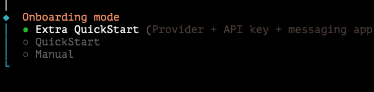

# 🤖 HandClaw

<p align="center">
  
</p>

<p align="center">
  <strong>一个 HandClaw — 多个项目</strong>
</p>

<p align="center">
  不需要很多 openclaws，一个就能控制全部。<br/>
  （支持 Slack、WhatsApp、Discord、Telegram、飞书）
</p>

> 💡 HandClaw 直接连接 OpenCode，提供慷慨的免费配额和高性能免费模型（Minimax M2.5 或 GLM 5）。

<p align="center">
  
</p>

> 💡 选择"Extra Quick Start"可以轻松安装 HandClaw。注意：你需要自行安装 Claude Code / Codex / OpenCode。

---

## ✨ 这是什么？

把 AI 编程助手（**Claude Code**、**Codex**、**OpenCode**）接入 **Slack**、**WhatsApp**、**Discord**、**Telegram** 或 **飞书**。每个频道用一个 CLI，不同频道可以用不同的助手。

<p align="center">
  
</p>


- 一个工作区，多个助手
- 多轮对话
- 重命名频道就能切换助手

---

## HandClaw: 提醒你工作完成！

<p align="center">
  
  
</p>

- 一个工作区 = 多个助手
- 手机甚至手表都能编程
- 走开，让助手干活去

---

## 我的故事

### 以前 — 被困在电脑前

<p align="center">
  
</p>

- 5 个显示器，各种窗口
- Claude Code、Codex、OpenCode 同时开着
- 离不开电脑，走不开
- 每次都要坐在电脑前

---

## 📖 如何使用

### 📱 手机就能写代码
用手机、平板，任何设备上的 Slack 都能控制编程助手。

### 🔀 一个频道 = 一个项目 = 一个助手

**格式**: `#l0-agent-repo_name`（前缀 `l0/l1/l2` 是可选的）

- `l0/l1/l2` — 自主级别前缀（可选）
- `agent` — 编程助手：`claude`、`codex`、`opencode`
- `repo_name` — 项目仓库名

```
#l0-claude-myapp   → Level 0（80% 需要确认）
#l1-opencode-api   → Level 1（半自主）
#l2-codex-prod     → Level 2（完全自主）
#claude-myapp      →（无前缀，默认）
```

**重要命令：**
- `!code <repo>` — 设置工作仓库（搜索 $WORKSPACE/repo_name，频道名不符合格式时使用）
- `!code switch plan` — 持久切换到 plan 模式
- `!code switch build` — 持久切换到 build 模式
- `!code model <model>` — 持久切换模型
- `!plan` — 一次性 plan 请求
- `!build` — 一次性 build 请求

### 🔄 切换助手

重命名频道即可切换助手和自主级别：

```
#l1-opencode-repo1 → #l0-claude-repo1
```

<table>
  <tr>
    <td align="center">
      <br/>
      <strong>频道命名</strong><br/>
      <em>l0-claude-repo1</em>
    </td>
    <td align="center">
      <br/>
      <strong>迁移</strong><br/>
      <em>重命名切换</em>
    </td>
    <td align="center">
      <br/>
      <strong>状态</strong><br/>
      <em>`@BotApp status` 查看</em>
    </td>
  </tr>
</table>

### 📊 查看状态

- `!rate` — 查看自主级别和通过率
- `@BotApp status` — 查看所有频道进度

### 🔄 Plan ↔ Build 模式

- `!code switch plan` — 持久切换
- `!code switch build` — 持久切换
- `!plan` / `!build` — 临时切换

---

## 📸 演示

<p align="center">
  
</p>

---

## 🛠️ 从源码构建

```bash
# 克隆并安装
git clone https://github.com/deciding/handclaw.git
cd handclaw
git submodule update --init --recursive
cd openclaw

# 安装和构建
pnpm install
pnpm ui:build
pnpm build

# 配置 Slack 并启动守护进程
pnpm handclaw onboard --install-daemon
```

### Slack 配置

见 [SLACK_INSTALL.md](./SLACK_INSTALL.md) 配置说明。

```json
{
  "requireMention": false,
  "groupPolicy": "open",
  "streaming": "block"
}
```

### WhatsApp 配置

```json
{
  "groups": {
    "120363407410666666@g.us": { // 群 ID（运行 handclaw logs --follow，在群里发消息获取）
      "requireMention": false
    }
  },
  "groupPolicy": "allowlist",
  "groupAllowFrom": ["phone-number"]
}
```

### Telegram 配置

```json
{
  "enabled": true,
  "dmPolicy": "pairing",
  "botToken": "YOUR_BOT_TOKEN",
  "groups": {
    "-5128902136": { // 群 ID
      "requireMention": false,
      "enabled": true
    }
  },
  "groupAllowFrom": [],
  "groupPolicy": "allowlist",
  "streaming": "block"
}
```

### Discord 配置

```json
{
  "enabled": true,
  "token": "YOUR_DISCORD_TOKEN",
  "groupPolicy": "open",
  "streaming": "off",
  "guilds": {
    "1480825735710118119": { // guild ID
      "channels": {
        "*": { // channel ID
          "requireMention": false
        }
      }
    }
  }
}
```

### 如何获取 ID

- **Telegram**: @BotFather 创建机器人，@myidbot /getid 获取用户 ID，群里 /getgroupid@myidbot 获取群 ID
- **Discord**: 频道链接包含 guild ID 和 channel ID：`https://discord.com/channels/{guild_id}/{channel_id}`

### 需要安装

- Node.js 22+
- pnpm
- Slack 工作区
- **自己安装**：Claude Code / Codex / OpenCode（需要单独安装，handclaw 不包含）

---

## 📖 文档

- [Getting Started](https://docs.openclaw.ai/start/getting-started)
- [Slack Setup](https://docs.openclaw.ai/channels/slack)

---

## 📜 License

MIT

---

<p align="center">
  <strong>试试看 →</strong>
</p>
