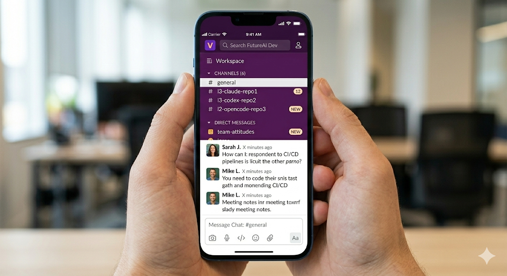

# 🤖 handclaw

<p align="center">
  
</p>

<p align="center">
  <strong>一个聊天 = 多个 AI 编程助手</strong>
</p>

<p align="center">
  随时随地编程。<br/>
  （支持 Slack、WhatsApp、Discord、Telegram、飞书）
</p>

---

## ✨ 这是什么？

把 AI 编程助手（**Claude Code**、**Codex**、**OpenCode**）接入 **Slack**、**WhatsApp**、**Discord**、**Telegram** 或 **飞书**。每个频道用一个 CLI，不同频道可以用不同的助手。

```
#l0-claude-myapp
  |
  +-- "写一个待办应用"          --> Claude Code
  |     "加个深色模式"          --> Claude Code
  |     "不错"                  --> Claude Code

#l1-codex-backend  (不同频道 = 不同 CLI)
  |
  +-- "优化一下 API"           --> Codex

#l0-opencode-utils  (再一个频道)
  |
  +-- "写写单元测试"           --> OpenCode
```

- 一个聊天工具 = 多个助手
- 多轮对话
- 重命名频道就能切换助手

---

## 安装 (Node ≥22)

```
npm install -g handclaw@latest
# 或: pnpm add -g handclaw@latest

handclaw onboard --install-daemon
```

---

## 我的故事

### 以前 — 被困在电脑前

<p align="center">
  
</p>

- 5 个显示器，各种窗口
- Claude Code、Codex、OpenCode 同时开着
- 离不开电脑，走不开
- 每次都要坐在电脑前

### 现在 — 躺平摸鱼

<p align="center">
  
</p>

- 一个聊天 = 所有助手
- 躺床上用手机就能编程
- 多轮对话，想聊多久聊多久
- 走开，让助手干活去

---

## 🎯 功能

### 📱 手机就能写代码
用手机、平板，任何设备上的 Slack 都能控制编程助手。

### 🧠 自我进化技能

为你的编程助手（Codex/OpenCode/Claude Code）添加技能：

- `skills/project_workflow` — 项目工作流自动化（构建、测试、部署）

> ⚠️ **注意**：需要手动把技能添加到你的编程助手里。每个助手有自己的技能加载方式。

### 🔀 一个频道 = 一个项目 = 一个助手

```
#l0-claude-repo1    → Level 0（最低，80% 需要确认）
#l1-opencode-repo2 → Level 1（半自主）
#l2-codex-prod     → Level 2（完全自主）
```

### 📋 频道命名规则

| 字段 | 说明 |
|------|------|
| l0/l1/l2 | 自主级别 |
| claude/codex/opencode | 编程助手 |
| repo1 | 项目名 |

### 🔄 切换助手

重命名频道即可切换助手和自主级别：

```
#l1-opencode-repo1 → #l0-claude-repo1
```

### 📊 查看状态

- `!rate` — 查看自主级别和通过率
- `@BotApp status` — 查看所有频道进度

### 🔄 Plan ↔ Build 模式

- `!code switch plan/build` — 持久切换
- `!plan` / `!build` — 临时切换

---

## 📸 演示

<p align="center">
  
</p>

---

## 🛠️ 快速开始

```bash
# 克隆并安装
git clone https://github.com/deciding/handclaw.git
cd handclaw
git submodule update --init --recursive
cd openclaw

# 安装和构建
pnpm install
pnpm ui:build
pnpm build

# 配置 Slack 并启动守护进程
pnpm handclaw onboard --install-daemon
```

### Slack 配置

```json
{
  "requireMention": false,
  "groupPolicy": "open",
  "streaming": "block"
}
```

### WhatsApp 配置

```json
{
  "groups": {
    "120363407410666666@g.us": { // 群 ID（从日志获取）
      "requireMention": false
    }
  },
  "groupPolicy": "allowlist",
  "groupAllowFrom": ["phone-number"]
}
```

1. 重启 handclaw，在群里发一条消息
2. 运行 `handclaw logs --follow` 查看群 ID
3. 把群 ID 加入白名单

### 需要安装

- Node.js 22+
- pnpm
- Slack 工作区
- **自己安装**：Claude Code / Codex / OpenCode（需要单独安装，handclaw 不包含）

---

## 📖 文档

- [Getting Started](https://docs.openclaw.ai/start/getting-started)
- [Slack Setup](https://docs.openclaw.ai/channels/slack)

---

## 📜 License

MIT

---

<p align="center">
  <strong>试试看 →</strong>
</p>
